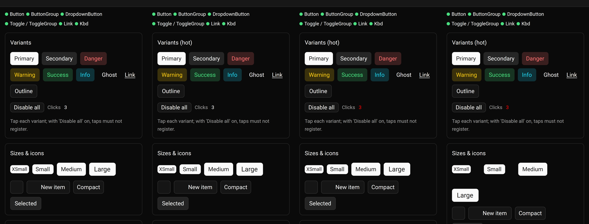

# Hot patching and over-the-air updates: plan

Two separate goals, with different rules:

- **A. Development:** see a Rust change on the phone in seconds, keeping app
  state. This is debug builds only, so store policy does not apply.
- **B. Production:** ship fixes without waiting for Google Play review, as
  Expo Updates does for React Native. Store policy decides what is possible.

## The constraint for B: Google Play policy

From the [Device and Network Abuse policy](https://support.google.com/googleplay/android-developer/answer/9888379):

> an app may not download executable code (such as dex, JAR, .so files) from
> a source other than Google Play

with an exception for

> code that runs in a virtual machine or an interpreter where either provides
> indirect access to Android APIs

Interpreted languages loaded at run time (the policy names JavaScript, Python
and Lua) must still not enable policy violations.

So:

- **Native code over the air is not allowed on Play.** That includes a new
  `.so`, which is how GPUI apps are built. It would be fine for sideloaded,
  enterprise/MDM or internal builds only.
- **React Native/Expo are allowed** because JS runs in an interpreter (Hermes).
  An equivalent for GPUI needs the updatable part to be data, or to run in an
  interpreter or VM.
- **WebAssembly is not named in the policy.** A WASM module that reaches the
  device only through functions the host provides plausibly fits "a virtual
  machine … with indirect access to Android APIs". That is a judgment call to
  confirm before relying on it.
- Apple has a similar rule (App Store Review Guideline 2.5.2); not checked here.

## Track A: development hot patching

### A0. Baseline (measured 2026-10-09)

Measured on this server (12 cores, memory capped at 7 GB, `-j 6`), building
the arm64 debug lab with `cargo ndk`:

| Step | Time |
|---|---|
| Clean Rust build | 4 min 54 s. The largest compiler process peaked at about 2 GB, so debug builds fit locally (release builds don't). |
| Incremental Rust build after a UI text change | ~6 s (3 s for a comment-only change) |
| Gradle `assembleDebug` with a cold JVM | 20 s |
| Debug APK | 265 MB. The library is 255 MB, about 190 MB of it debug sections (line tables + DWARF strings/ranges); `.text` is 21 MB. |
| `llvm-strip --strip-debug` | 0.3 s, 255 MB → 49 MB |
| `adb push` of 49 MB through the ssh tunnel | ~8 s (1.3 s of transfer) |
| CI release build (two ABIs, warm cache) | 4–6 min |

Conclusions:

- Compiling Rust is not the bottleneck locally. Gradle, the huge debug APK
  and reinstalling are.
- A dev client that pushes a *stripped* `.so` (symbolising crashes locally
  against the unstripped one, as `ndk-stack` does) gets a change onto the
  phone in about 6 + 0.3 + 8 s plus a restart, ~15 s, with no Gradle and no
  reinstall. Only hot patching beats that, and keeps state.
- `build.sh` also packaged gpui-mobile's own library by mistake (137 MB in
  debug builds); fixed in #31.

### A1. Subsecond spike (go/no-go): done, go

[Subsecond](https://docs.rs/subsecond) (Dioxus) is a Rust hot-patching
library:

- Calls go through a jump table. An external tool compiles only the changed
  code, links it against the running binary's addresses, and sends the
  running app a new jump table.
- It supports Android arm64. It is active only with debug assertions, so it
  costs nothing in release builds.
- Limits:
  - Only the **tip crate** (the binary/cdylib's own crate) is patched.
  - Struct layout changes are not supported.
  - Thread-locals in the tip crate reset on each patch.
  - Static initialisers are not re-run.

#### Result (spike, 2026-10-09): go, with transport as the open item

Edits to a lab screen's text, colour and layout show on the phone **without
a restart, keeping the current screen, inputs and view state**. With the
phone reached through the ssh tunnel, a change took 5.4–6.2 s from saving
the file to the patch being applied, so the < 2 s exit criterion was **not
met as measured**. Building the patch takes ~1.6 s; the rest is pushing
~10 MB through the tunnel.

*Verified on the phone (OnePlus CPH2581, Android 16).* From left: the
Buttons screen after three taps (Clicks 3), then a patch each for the section
title, the Clicks colour and the size row's gap. The screen was opened after
an earlier patch. The catalog's search text also survived patches.

Timings per edit, measured on the phone (4 edits; first edit after a base build is slower):

| Step | Time |
|---|---|
| `rustc` on the lab crate (incremental) | 1.2–1.6 s |
| Stub object + link + jump table + strip | 0.3–0.4 s |
| `adb push` of the 9.9 MB patch through the ssh tunnel | 3.6–4.9 s |
| Saving the file → patch applied on the phone | 5.4–6.2 s |

Over a local USB connection the push should take well under a second, which
would bring a change to ~2 s. *Not measured: the phone was only reachable
through the tunnel.*

How it works (`tools/hotpatch`, `src/hot.rs`):

- `hotpatch fat` builds the debug APK with itself as `RUSTC_WORKSPACE_WRAPPER`
  and as the lab's linker. That records the lab crate's `rustc` command and
  link arguments, and adds `-Csave-temps -Clink-dead-code -Clto=off`. The APK
  ships the library with DWARF stripped (94 MB APK). The unstripped library
  stays on the host.
- `hotpatch watch` re-runs the recorded `rustc` on each save. It then links
  all of the lab's objects with a stub object into a patch library. The stub
  object sends every other symbol to its address in the running app (base
  address + ASLR slide, read once from the app's log).
  This is the ELF/aarch64 part of the Dioxus CLI's "thin linking" (~500
  lines of Rust), adapted from its source with credit in
  `tools/hotpatch/README.md`.
  The tool pushes the patch and its jump table to `/data/local/tmp/gpui-hot`.
- In the app, a GPUI task checks for a new table every 50 ms. Between frames
  it calls `subsecond::apply_patch` (which loads the library through a memfd),
  then `cx.refresh_windows()`.

What the spike changed from the plan:

- **`dx` can't be reused as is.** It generates its own Gradle project and
  Activity, and assumes the app is a bin crate (its lib path passes
  `--lib <name>`, which cargo rejects). The patch builder's core (rustc
  replay, stub object, jump table) is small enough to own. The `dioxus-cli`
  crate is not a library.
- **The hook can't go in gpui-mobile's frame loop.** Subsecond only redirects
  closures defined in the patched crate: the jump table maps the address of
  `HotFunction::call_it` for the closure given to `subsecond::call`. GPUI
  calls each view's `render` through a vtable built when the entity was
  created. So the lab's 31 `Render` impls go through a macro,
  `hot_render!(Type)`, that wraps an inherent `render_view` in
  `subsecond::call`.
- **No websocket.** `adb reverse` forwards to the machine running the adb
  server, which is the user's laptop, not the build server. The patch is
  pushed with one `adb push` (library, then table) and the app polls.
- **Local ThinLTO dominated the compile.** At `opt-level = 1` rustc runs
  crate-local ThinLTO: ~5 of ~6 s for a one-line change. `-Clto=off` brings
  it to ~1.2 s.

Limits hit:

- **Views created by an earlier patch.** Code that runs from a patch also
  reads the patch's own copy of the lab's statics. That includes the screen
  table, so a screen opened after a patch is an entity whose vtable points
  into that patch. Subsecond maps only the original library's addresses, so
  later patches never reached that screen. Fixed: each patch's table also
  maps every earlier patch's hot closures to the new ones, and `src/hot.rs`
  rebases them to where it loaded that patch (`dl_iterate_phdr`).
  Upstream Subsecond would need the same.
- **Statics in the lab crate fork on the first patch.** The patch has its own
  copies, which start from their initial values. The catalog's "Android API"
  row read a static set by JNI at startup and showed "unknown" after any
  patch, because JNI keeps writing the app's copy. Code from different
  codegen units reaches the crate's own data PC-relatively, so it can't point
  at the running app's copy. Linking only the changed objects doesn't help
  either: the callers of changed code must come from the patch too, which
  pulled in 252 of 257 objects. Workaround: keep process state that must
  survive patches in a dependency crate, or in GPUI entities and globals.
- **Thread-locals reset; struct layout changes and new dependencies need a
  restart** (as documented by Subsecond, not exercised here).
- **Not yet handled:** listeners registered once at entity creation
  (`cx.subscribe`, `cx.observe`) keep running old code. Elements rebuilt every
  frame (`on_click` and so on) pick up new code.
- **Patches are not freed.** Each patch library (~10 MB) stays loaded.

Side findings for A0/A2:

- `build.sh` debug APKs carried dead space. Gradle repackages in place, so
  the "265 MB" debug APK in A0 includes stale bytes. The stripped library
  makes a 94 MB APK.
- Each `-Csave-temps` compilation leaves ~65 MB of objects. The tool deletes
  them after each patch.

What `cargo gpui dev` needs to productise this:

1. Fold `tools/hotpatch` into the CLI. Read the app's ASLR reference from a
   file or a socket instead of logcat, which rotates within minutes.
2. Replace the per-type `hot_render!` with something users don't have to
   write. Options: a derive or attribute macro, or a hook in GPUI that wraps
   `render` for views in the app crate. The closure must be monomorphised in
   the app crate; that's untested.
3. Make patches smaller and faster to ship. Options: compression, splitting
   the app crate (A3), and a local adb server when the phone is on USB.
   Measure end to end over USB before promising "< 2 s".
4. Fall back to A2 (reload the `.so`) when a patch fails to link, or when a
   struct layout changes.

Recommendation: **go**. Hot patching keeps state and needs no Gradle, so it
is worth productising. Ship A2 first: it covers every change Subsecond can't
patch, and it is how the base gets onto the phone.

### A2. Fast full reload ("GPUI Go" dev client)

Needed even if A1 works, for the changes Subsecond cannot patch: struct
changes, gpui/Kit/gpui-mobile changes, new dependencies.

- A debug host APK is built once. On start it loads the app library from its
  private directory (`System.load(path)`), falling back to the packaged one.
- `cargo gpui dev` (our CLI, below) builds the arm64 debug `.so`, pushes it
  (`adb push` + `run-as` copy), and restarts the app process. No Gradle, no
  reinstall.
- Optional: save and restore a small "dev state" (current screen, scroll) so
  a reload lands where you were.

Exit criteria: Rust change to running new code in about 15 s, per the A0
numbers.

### A3. Build speed

Measure, then apply what helps:

- **arm64 only for dev builds.**
- **Linker:** NDK clang already uses lld; try `-Z threads`/mold where
  available.
- **Caching:** `sccache`.
- **Lighter dev builds:**
  - `debug = 0` for dependencies;
  - splitting the lab crate so a screen change recompiles little;
  - the Cranelift backend for the tip crate, if it supports aarch64-android.

## Track B: production updates without a store release (deferred)

**Status: deferred.** The goal is to make a Rust app work on mobile, not to
build an update platform. On Play the only legal ways to change behaviour
without a release are to ship data (server-driven UI, or state and logic that
live on a server) or code in a VM such as WASM. Both are substantial
infrastructure. Revisit when a real app needs it; the notes below record what
was found.

### B1. Update infrastructure (`gpui-updates`)

The part of Expo Updates that is independent of what gets updated:

- A signed manifest per channel/runtime version, with staged rollout.
- Download in the background, verify the signature, swap atomically on the
  next launch.
- Automatic rollback when the new bundle crashes at start.

It first ships **data**, which is clearly allowed: themes, strings, images,
remote config, feature flags. B2/B3 reuse it for code.

### B2. Server-driven UI (data, allowed)

A declarative UI format, for example JSON or a small DSL, that describes GPUI
Kit components, layout, text and bindings to actions the app registers
natively. Screens can change without a release; behaviour stays limited to
the registered actions. Moderate effort, no policy risk.

### B3. WASM modules for UI and logic (policy to confirm)

Closest to "React Native for Rust":

- App screens and logic compile to WASM and run in an embedded runtime.
  Candidates: `wasmi`, a pure-Rust interpreter, or `wasmtime`. JIT on Android
  needs checking.
- The module returns an element tree and handles events through a typed
  interface (WIT). The host maps the tree to GPUI elements and exposes device
  APIs only through host functions.
- Large effort: the guest UI API is a framework in itself. Spike it before
  committing:
  1. render a few elements;
  2. handle input;
  3. measure frame cost under `wasmi`.

Decide between B2 and B3 after B1 and the spike. They can coexist: B2 for
content-driven screens, B3 for logic.

## A Rust "Expo", piece by piece

| Expo | Here |
|---|---|
| Expo Go / dev client | A2: debug host APK that loads a pushed `.so` |
| Fast Refresh | A1: Subsecond |
| Expo Updates | B1 (+ B2/B3) |
| `expo prebuild`, config plugins | `cargo gpui new` / `prebuild`: generate the host Activity, manifest and helpers from config. This also removes "hosts must copy Java files" |
| EAS Build | GitHub Actions (exists) |
| CLI | `cargo gpui` (`dev`, `build`, `publish`), wrapping cargo-ndk, Gradle, adb |

## Order

1. A0 baseline. Running.
2. A1 Subsecond spike: go/no-go.
3. A2 dev client. Needed either way.
4. A3 build speed, guided by A0.
5. `cargo gpui` CLI, folding in A1 and A2 as they land.
6. Track B only when a real app needs it.
